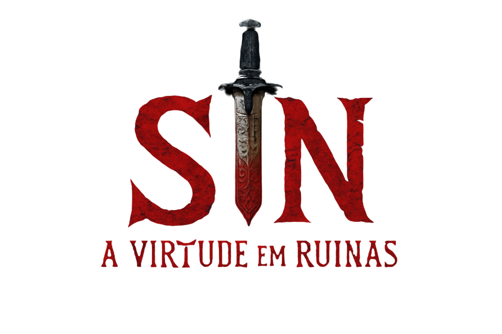

# 🌌 Sin: O Vigia do Vazio



## 🎮 Bem-vindo ao Reino das Escolhas Impossíveis!

Prepare-se para uma jornada épica onde cada decisão pode salvar um reino... ou destruí-lo completamente (sem pressão! 😅).

### 🌟 O que é Sin?

Sin é mais que um jogo - é uma experiência narrativa onde você encarna um ser místico enfrentando dilemas surreais e consequências inimagináveis. Tipo aquela vez que você teve que decidir se aceitava rosas de mil demônios... sabe como é, só mais um dia normal na vida de um Vigia! 

### ✨ Características Principais

- 🎭 **Escolhas Surreais**: Desde consolar carrascos deprimidos até negociar com serpentes marinhas que só queriam bronzear
- 🌊 **Narrativa Profunda**: Cada história é um mergulho em um oceano de possibilidades (às vezes literalmente!)
- 🎨 **Arte Única**: Imagens belíssimas que capturam a essência de cada momento bizarro
- 🎯 **Consequências Reais**: Suas escolhas afetam o mundo... e sua sanidade!

### 🎲 Como Jogar

1. 👆 **Deslize** para direita (SIM) ou esquerda (NÃO)
2. 🤔 **Reflita** sobre suas escolhas (ou não, viver perigosamente também é uma opção)
3. 📖 **Descubra** as consequências (surpresa!)
4. 🔄 **Repita** até salvar o mundo ou... bem, você sabe...

### 🛠️ Tecnologias Usadas

- ⚛️ React Native
- 🎨 Animações Fluidas
- 🎵 Efeitos Sonoros Imersivos
- 🌈 Design Responsivo

### 📱 Como Instalar

```bash
# Clone este repositório (se prepare para a aventura!)
git clone https://github.com/seu-usuario/sin-game.git

# Instale as dependências (são muitas, como os pecados de Sin)
npm install

# Inicie a jornada!
npm start
```

### 🎮 Modo de Jogo

Cada escolha afeta três elementos principais:
- 💖 **Pessoas Salvas**: Quantas almas você conseguiu proteger
- 💀 **Sacrifícios**: O preço da sua misericórdia (ou falta dela)
- 🧠 **Sanidade**: Quanto você ainda consegue distinguir o real do surreal

### 🌟 Momentos Épicos

> "Um dragão sobrevoou as capitais querendo conselhos sobre alianças de casamento..."
> 
> "A lua decidiu se aproximar para um abraço gravitacional..."
> 
> "Ratos iniciaram negociações diplomáticas..."

### 🤝 Contribua!

Tem uma ideia para uma escolha impossível? Uma consequência surreal? Um dilema existencial envolvendo pinguins filósofos? Abra uma issue ou envie um PR!

### ⚠️ Aviso

Este jogo pode causar:
- 🤯 Explosões mentais
- 😱 Questionamentos existenciais
- 🤔 Filosofias de boteco
- 😂 Risadas nervosas
- 🎭 Dramas cósmicos

### 📜 Licença

MIT License - Sinta-se livre para copiar, modificar e distribuir, mas lembre-se: com grandes poderes, vêm grandes responsabilidades... e consequências surreais!

---

> "Às vezes, a escolha mais difícil é escolher qual escolha escolher." 
> - Sin, provavelmente, em um momento particularmente confuso

---

Desenvolvido com 💖 e uma dose saudável de caos cósmico.

*PS: Nenhum dragão foi magoado durante o desenvolvimento deste jogo. Apenas levemente desapontado com suas escolhas de vida.*